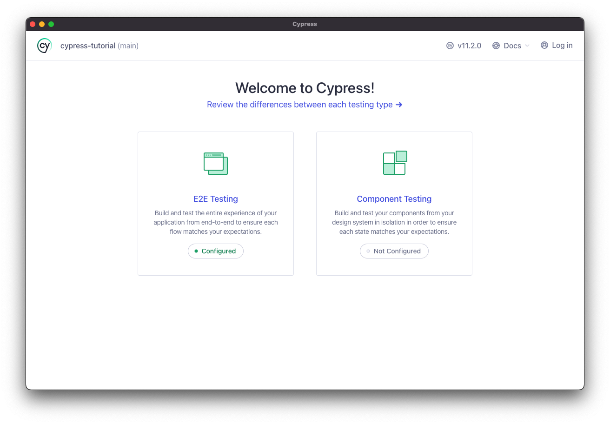
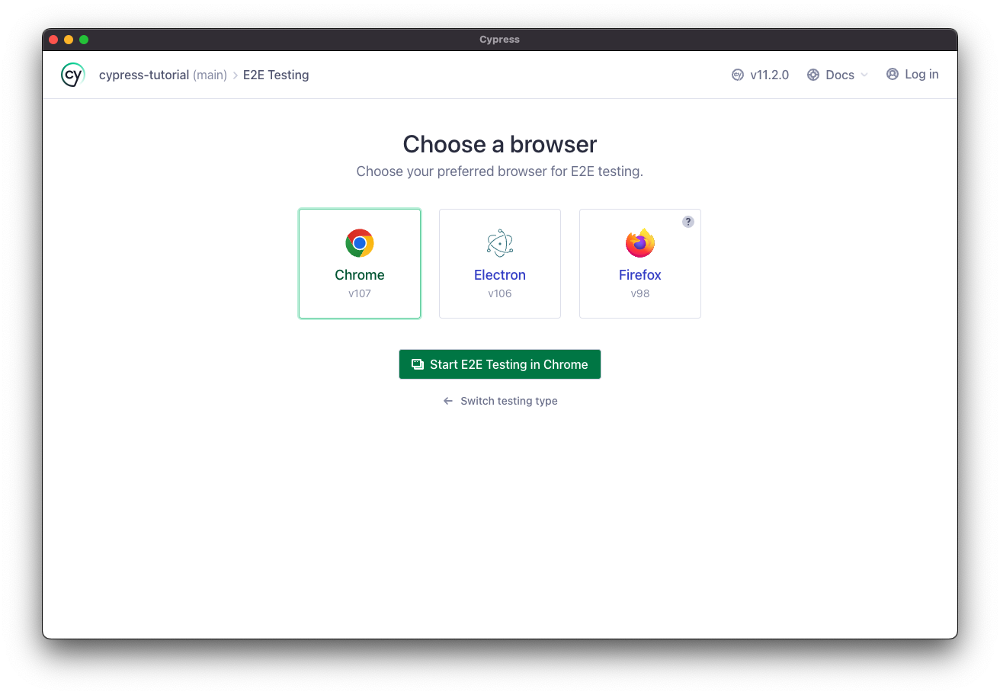
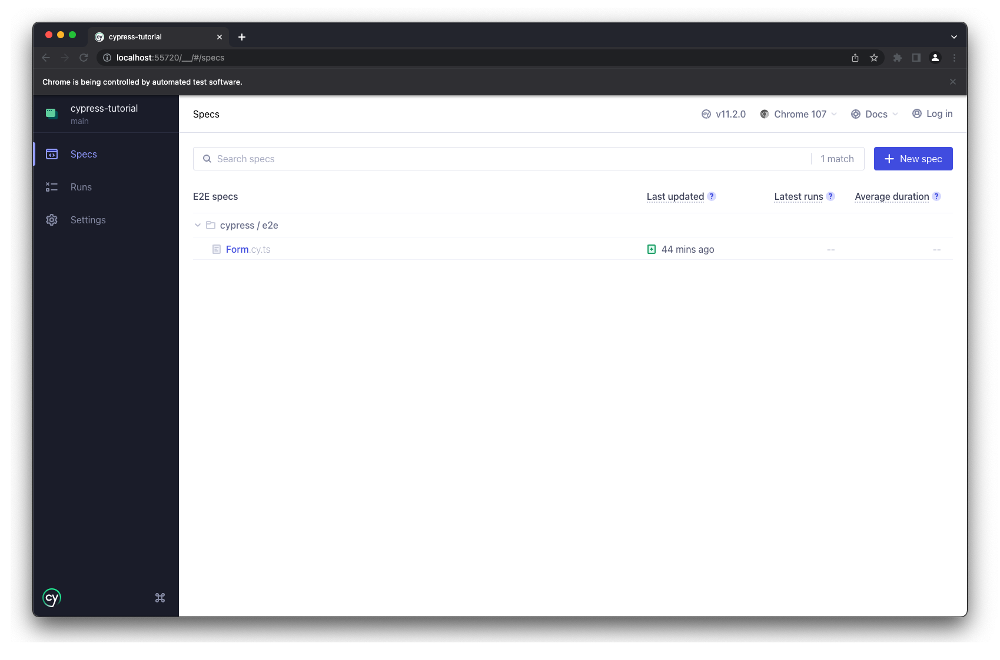
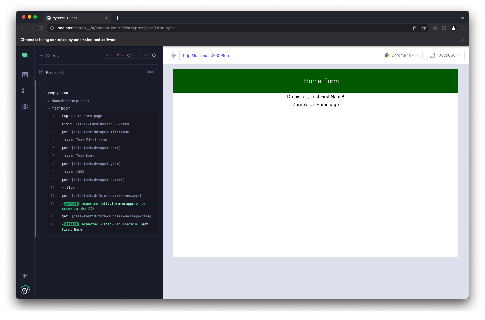

# Getting started

`npm i` ausführen

### In einem Terminal 

`npm run start`

### In einem weiteren Terminal 

`node_modules/.bin/cypress open`

### Dann in der Gui weiter navigieren 

### E2E Testing auswählen

### Browser der Wahl auswählen und "Start E2E Testing in Chrome"

### Form.cy.ts anklicken 

## Test läuft automatisch durch! :)